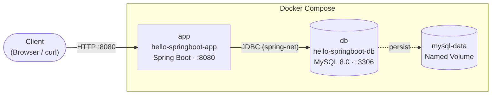

# hello-springboot


Spring Boot 4 기반 Product CRUD REST API 실습 프로젝트.  
레이어드 아키텍처(Controller → Service → Repository → Entity)와 Docker 컨테이너 환경을 함께 학습합니다.

---

## 컨테이너 아키텍처



> `app` 컨테이너는 DB healthcheck 통과 후 기동됩니다 (`depends_on: service_healthy`).  
> 두 컨테이너는 내부 브리지 네트워크 `spring-net`으로만 연결되어 외부에서 DB에 직접 접근할 수 없습니다.

---

## 기술 스택

| 항목 | 내용 |
|------|------|
| Java | 21 LTS — Virtual Threads (Project Loom) |
| Spring Boot | 4.0.6 (Spring Framework 7.0.7) |
| ORM | Spring Data JPA + Hibernate 7.2.12 |
| Database | MySQL 8.0 (Docker), H2 (테스트) |
| Build | Maven — Fat JAR (내장 Tomcat) |
| Container | Docker + Docker Compose |
| Monitoring | Spring Boot Actuator |

---

## 프로젝트 구조

```
hello-springboot/
├── src/
│   ├── main/
│   │   ├── java/kr/ac/hansung/hellospringboot/
│   │   │   ├── HelloSpringBootApplication.java    # @SpringBootApplication 진입점
│   │   │   ├── controller/
│   │   │   │   └── ProductController.java         # Presentation Layer — REST 엔드포인트
│   │   │   ├── service/
│   │   │   │   └── ProductService.java            # Business Layer — 트랜잭션·비즈니스 로직
│   │   │   ├── repository/
│   │   │   │   └── ProductRepository.java         # Data Access Layer — JpaRepository
│   │   │   └── model/
│   │   │       └── Product.java                   # Domain Model — JPA 엔티티
│   │   └── resources/
│   │       ├── application.properties             # 공통 설정 (Virtual Threads, Actuator)
│   │       ├── application-dev.properties         # 개발 환경 (ddl-auto=create-drop)
│   │       ├── application-prod.properties        # 운영 환경 (환경변수 주입)
│   │       └── data.sql                           # 초기 샘플 데이터 (dev 프로파일 전용)
│   └── test/
│       ├── java/.../HelloSpringBootApplicationTests.java
│       └── resources/
│           └── application.properties             # 테스트용 H2 인메모리 DB 설정
├── Dockerfile                                     # 멀티 스테이지 빌드 (JDK → JRE)
├── docker-compose.yml                             # app + MySQL 서비스 정의
└── pom.xml
```

---

## 사전 요구사항

| 도구 | 버전 | 확인 명령어 |
|------|------|-------------|
| Docker Desktop | 4.x 이상 | `docker --version` |
| Java JDK | 21 이상 | `java -version` |

> 로컬 실행 시 MySQL 8.0이 추가로 필요합니다.

---

## 실행 방법

### Docker Compose 실행 (권장)

MySQL 컨테이너와 Spring Boot 앱을 함께 기동합니다.

```bash
# 1. 환경 초기화 (기존 컨테이너·볼륨 완전 삭제)
docker compose down -v

# 2. 이미지 빌드 및 컨테이너 시작
docker compose up --build

# 백그라운드로 실행
docker compose up --build -d

# 로그 확인
docker compose logs -f app

# 종료 (DB 데이터 유지)
docker compose down

# 종료 + DB 데이터 삭제
docker compose down -v
```

> DB healthcheck 통과 후 앱이 시작됩니다 — `depends_on: condition: service_healthy`

### 로컬 실행 (dev 프로파일)

```bash
# 1. MySQL에서 데이터베이스 생성
CREATE DATABASE hellodb CHARACTER SET utf8mb4 COLLATE utf8mb4_unicode_ci;

# 2. 애플리케이션 실행 (기본 프로파일: dev)
./mvnw spring-boot:run

# 또는 Fat JAR 빌드 후 실행
./mvnw package -DskipTests
java -jar target/hello-springboot-0.0.1-SNAPSHOT.jar
```

### 테스트 실행

H2 인메모리 DB를 사용하므로 MySQL 없이 실행 가능합니다.

```bash
./mvnw test
```

---

## API 엔드포인트

**Base URL:** `http://localhost:8080`

| 메서드 | URL | 설명 | 성공 | 실패 |
|--------|-----|------|------|------|
| `GET` | `/api/products` | 전체 상품 목록 조회 | `200 OK` | — |
| `GET` | `/api/products/{id}` | 단일 상품 조회 | `200 OK` | `404 Not Found` |
| `POST` | `/api/products` | 상품 등록 | `201 Created` | `400 Bad Request` |
| `PUT` | `/api/products/{id}` | 상품 수정 | `200 OK` | `404 Not Found` |
| `DELETE` | `/api/products/{id}` | 상품 삭제 | `204 No Content` | `404 Not Found` |

### 요청 / 응답 예시

**상품 등록 — POST `/api/products`**

```bash
curl -X POST http://localhost:8080/api/products \
  -H "Content-Type: application/json" \
  -d '{"name":"Laptop","price":1500000,"description":"Gaming Laptop"}'
```

```json
HTTP/1.1 201 Created

{
  "id": 1,
  "name": "Laptop",
  "price": 1500000,
  "description": "Gaming Laptop"
}
```

**상품 수정 — PUT `/api/products/{id}`**

```bash
curl -X PUT http://localhost:8080/api/products/1 \
  -H "Content-Type: application/json" \
  -d '{"name":"Laptop Pro","price":2000000,"description":"Updated model"}'
```

```json
HTTP/1.1 200 OK

{
  "id": 1,
  "name": "Laptop Pro",
  "price": 2000000,
  "description": "Updated model"
}
```

**상품 삭제 — DELETE `/api/products/{id}`**

```bash
curl -X DELETE http://localhost:8080/api/products/1
```

```
HTTP/1.1 204 No Content
```

**존재하지 않는 ID 조회**

```bash
curl http://localhost:8080/api/products/9999
```

```json
HTTP/1.1 404 Not Found

{
  "timestamp": "2026-05-07T09:00:00.000Z",
  "status": 404,
  "error": "Not Found",
  "path": "/api/products/9999"
}
```

### Actuator 엔드포인트

| URL | 설명 |
|-----|------|
| `GET /actuator/health` | 애플리케이션 헬스 상태 (`UP` / `DOWN`) |
| `GET /actuator/info` | 애플리케이션 정보 |
| `GET /actuator/beans` | 등록된 모든 Spring Bean 목록 |
| `GET /actuator/metrics` | CPU·메모리·HTTP 요청 메트릭 |

---

## 환경변수 (prod 프로파일)

Docker Compose 또는 운영 환경에서 아래 환경변수를 설정합니다.

| 환경변수 | 설명 | 예시 |
|----------|------|------|
| `SPRING_PROFILES_ACTIVE` | 활성 프로파일 | `prod` |
| `DB_URL` | MySQL JDBC URL | `jdbc:mysql://db:3306/hellodb?useSSL=false&serverTimezone=UTC` |
| `DB_USERNAME` | DB 사용자 이름 | `root` |
| `DB_PASSWORD` | DB 비밀번호 | `1234` |

---

## 프로파일별 설정

| 항목 | `dev` | `prod` |
|------|-------|--------|
| DB 접속 | `localhost:3306` | 환경변수 `${DB_URL}` |
| `ddl-auto` | `create-drop` (매 시작마다 초기화) | `update` (스키마 변경만 반영) |
| SQL 로그 | ON | OFF |
| `data.sql` 실행 | O | X |
| 로그 레벨 | `DEBUG` | `INFO` |

---

## DB 스키마

`products` 테이블 — Hibernate `ddl-auto`에 의해 자동 생성됩니다.

| 컬럼 | 타입 | 제약조건 | 설명 |
|------|------|----------|------|
| `id` | `BIGINT` | PK, AUTO_INCREMENT | 상품 고유 식별자 |
| `name` | `VARCHAR(255)` | NOT NULL | 상품명 |
| `price` | `INT` | NOT NULL | 가격 (원 단위) |
| `description` | `TEXT` | NULL 허용 | 상품 설명 |

---

## 핵심 개념

### @SpringBootApplication

```java
@SpringBootApplication
// = @SpringBootConfiguration  → IoC 컨테이너 설정 클래스 선언
// + @EnableAutoConfiguration  → 클래스패스 기반 자동 Bean 등록
// + @ComponentScan            → 현재 패키지 이하 Bean 자동 스캔
```

**Auto Configuration 동작 원리**

1. `@EnableAutoConfiguration`이 `AutoConfiguration.imports`에서 후보 설정 클래스 로드
2. `@ConditionalOnClass`, `@ConditionalOnMissingBean` 등의 조건 평가
3. 조건을 만족한 클래스만 Bean으로 등록

> 예시: `spring-boot-starter-data-jpa` 추가 시  
> → `DataSource` (HikariCP), `EntityManagerFactory`, `TransactionManager` 자동 생성

### Virtual Threads (Java 21)

```properties
spring.threads.virtual.enabled=true
```

| 구분 | Platform Thread | Virtual Thread |
|------|----------------|----------------|
| 생성 주체 | OS | JVM |
| 메모리 | ~1MB / thread | ~수 KB / thread |
| I/O 대기 | OS 스레드 블록 | 캐리어 스레드 반환 후 재개 |
| 최대 동시성 | 수천 | 수백만 |

기존 동기식 코드 변경 없이 높은 동시성 처리가 가능합니다.

### 멀티 스테이지 Docker 빌드

```dockerfile
# Stage 1: 빌드 (JDK + Maven)
FROM eclipse-temurin:21-jdk-alpine AS builder
RUN ./mvnw package -DskipTests -B

# Stage 2: 실행 (JRE만 포함 — 이미지 크기 최소화)
FROM eclipse-temurin:21-jre-alpine
COPY --from=builder /app/target/*.jar app.jar
ENTRYPOINT ["java", "-XX:+UseContainerSupport", "-jar", "app.jar"]
```

최종 이미지에 JDK, Maven, 소스코드가 포함되지 않아 보안과 이미지 크기를 최적화합니다.
